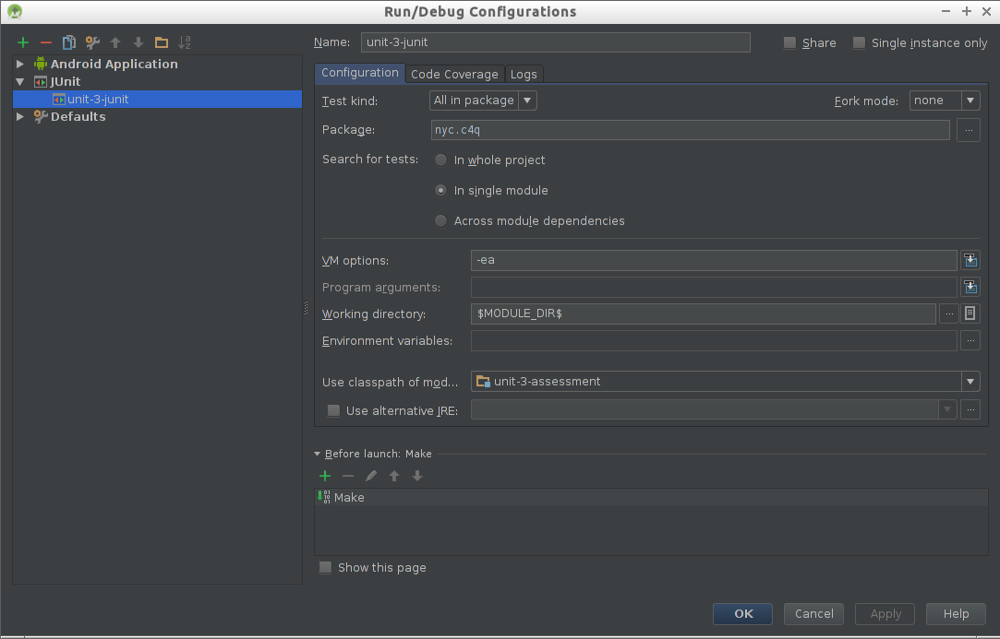
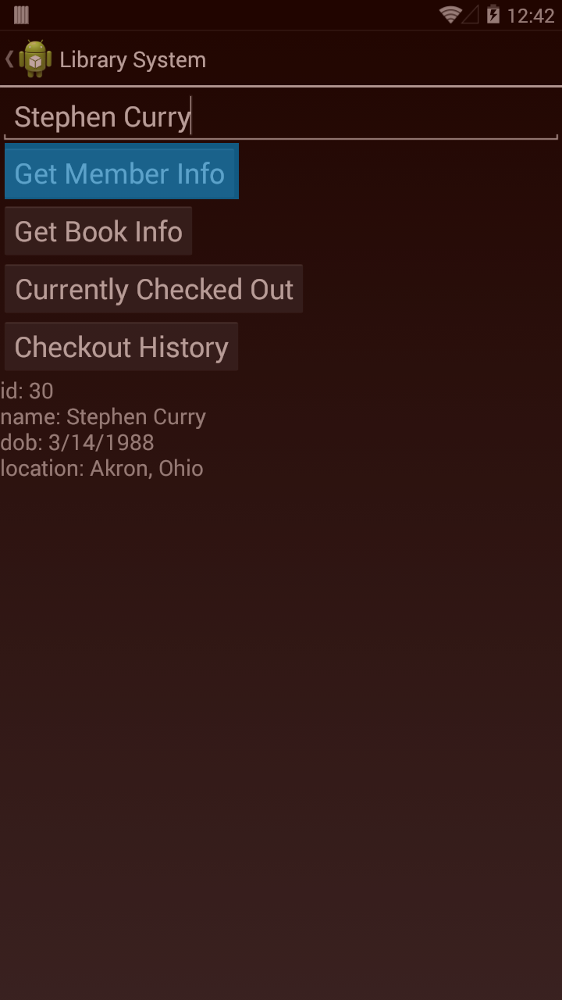
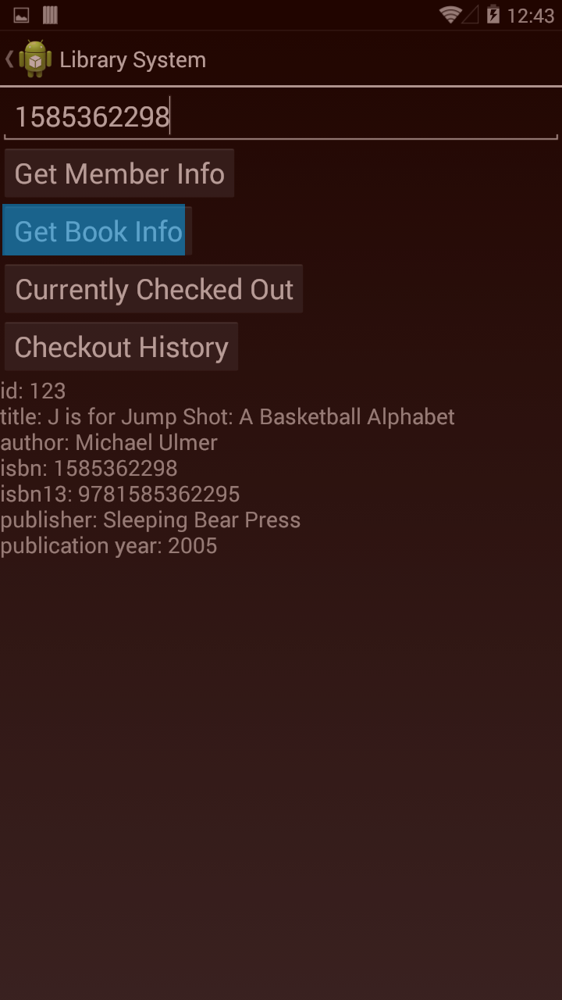
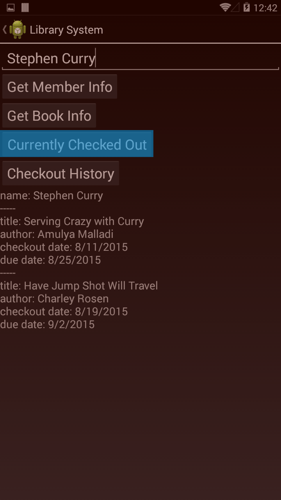

## Final Assessment
This is designed to run with Android Studio with
[Unit Testing support](https://sites.google.com/a/android.com/tools/tech-docs/unit-testing-support) enabled in Android Studio's Gradle settings.

### Importing
Import the project into Android Studio by selecting `Import Project` and selecting the project's `build.gradle`. When prompted, you can pick the default gradle wrapper.

### Running Tests
To run the test, open Android Studio's [Build Variants](https://sites.google.com/a/android.com/tools/tech-docs/unit-testing-support/qSxL68MPv5.png) pane and change the option `Test Artifact` to `Unit Tests`. You can then right click on `Unit1AndroidAssessmentTests` and run the tests.

Your run configuration should look like this:

> 

### Specs

#### 1. Pace Calculator

Create a Fragment using the provided layout `fragment_pace_calculator.xml`. Implement the following logic for the pace calculator:

* The user will input data for two of the three variables, distance, time, and pace. When the user presses "Calculate", the third variable will be calculated and filled in.
* If the user specifies data for zero, one, or all of the variables, do nothing.
* If the user specifies invalid data for any of the variables, do nothing.

#### 2. Library System

* Create a SQLite database to hold the data in the two JSON files in `data/`. (Hint: look at book id 14 for a list of all the fields for a book.)
* Provide the implementations for the function stubs in `LibraryActivity.java`.
* When the user provides the parameter in the input box (either a name or an ISBN) and presses a button, call the corresponding function and show the results in the TextView. The format is specified below.

> 
> 
> 

#### 3. Library Members

Using the same SQLite database from problem 2 and the provided layout `listitem_member.xml`, show a list of all members of the library. For members who have overdue books, show their name in red (#AA0000).

##### Bonus

Provide persistent options to show the list:

* With the name formatted "First Last" or "Last, First"
* Sorted by ID, first name, or last name

### Grading

When you are done, go outside and talk to a TA. Even if no tests are passed, the TA can make judgements about your code and determine if you understand this material well enough to move on.
